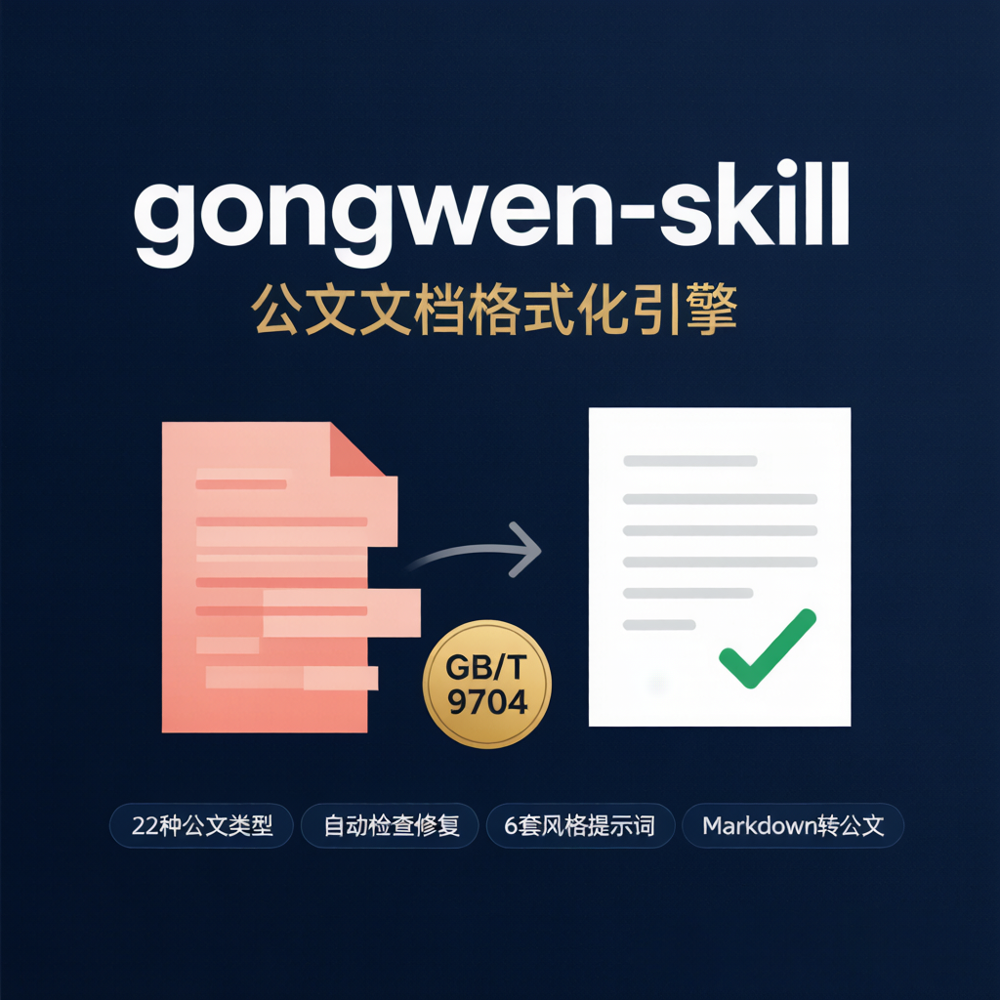
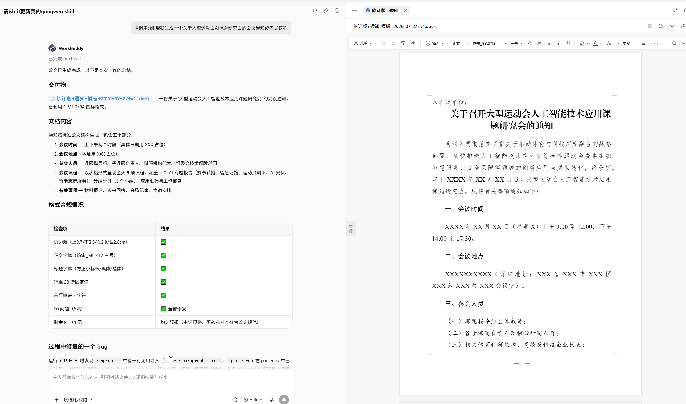
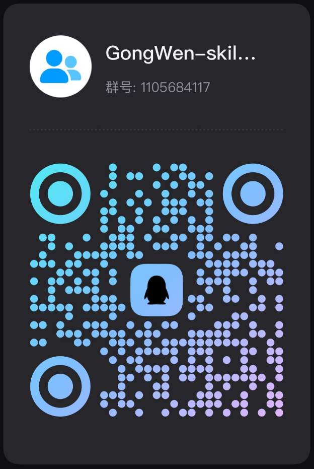

<!--
(c) 2026 Jose AI (https://www.linhut.cn)
Licensed under the MIT License. See the LICENSE file for details.
-->

# 中文公文全流程工具 · gongwen-skill

<p align="center">
  
</p>

> 中文公文全流程处理工具——基于 **GB/T 9704《党政机关公文格式》** 国家标准，支持 **格式检查与修复、内容优化（Word 原生修订+批注/差异对比版）、模板生成、Markdown 转公文、版头版记页码注入、事实核验、风格增强** 等完整能力。原生支持 **DeepSeek Harness (DSH)** 技能系统，打包为可被 AI Agent 直接调用的 Skill，完全自包含，克隆即用。

[](https://github.com/linhut/gongwen-skill/actions)
[](https://pypi.org/project/gongwen-skill/)
[](./LICENSE)


本 Skill 源自开源桌面项目 [AI 公文智能优化助手](https://github.com/linhut/document-ai-assistant)，将其核心格式引擎抽取、剥离桌面端/数据库依赖后独立发行，支持公文的**模板建立、解析、规则检查、自动修复、内容优化、Markdown 转公文**全流程能力。同时原生集成 **DeepSeek Harness (DSH)** 技能系统，支持 DSH Agent 自动发现与加载。

---

## ✨ 能力一览

| 能力 | 命令 | 说明 |
|------|------|------|
| 📋 列类型 | `list-types` | 列出 25 种支持的公文类型（含新闻稿/讲话稿主持词） |
| 🏗️ 模板生成 | `template` | 按类型生成 GB/T 9704 标准空白模板 |
| 🔍 解析 | `parse` | `.docx` → 结构化 DocumentModel |
| ✅ 格式检查 | `check` | 按国标检查，分级 P0/P1/P2（只读） |
| 🔧 格式修复 | `optimize` | 自动修复字体/字号/行距/页边距，输出合规文档 |
| ✍️ **内容优化** | **`optimize-content`** | 内容润色：默认 **Word 原生修订+批注**（审阅面板逐条接受/拒绝），可选行内差异对比版 |
| 📝 草稿转公文 | `md2docx` | Markdown 文本直接转为格式化 `.docx`（支持 Front Matter） |
| 📄 模型生成 | `generate` | 从 JSON 模型生成 `.docx` |
| 🔴 版头 | `header` | 注入发文机关标志 + 发文字号 + 签发人 + 红色反线 |
| 📑 版记 | `footer` | 注入抄送机关 + 印发机关 + 印发日期 + 分隔线 |
| 🔢 页码 | `pagenum` | 注入 Word PAGE 域动态页码（宋体 4 号，默认单右双左适配双面打印） |
| 🖊️ 首句加粗 | `bold-first` | 正文段落首句自动加粗（公文规范） |
| 📋 桌签生成 | `table-signs` | 批量生成 A5 横版会议桌签 |
| 🔍 审稿生成 | `review` | 按五角色审稿机制生成审稿意见 |
| 🧩 完整审校 | `full-review` | 修订+批注联合命令（句子级差异修订 + 分类批注） |
| 🎨 样式学习 | `style-learn` / `style-list` | 从标准文档学习 Run/段落/页面三级样式，生成命名模板持久化 |
| 🔄 版本自检 | `check-update` | 多渠道版本自检（GitHub/GitCode/AtomGit 三仓库比对取最新） |
| 🕵️ 文档审计 | `audit` | 检查删除线/加粗/AI 声明等痕迹 |
| ⚙️ 规则管理 | `rule-export/import/list` | YAML 规则三层定制（官方/单位/用户） |

## 使用示例



> 在 AI 对话中调用 gongwen-skill，输入自然语言指令，自动生成符合 GB/T 9704 国标格式的正式公文。

## 🚀 快速开始

```bash
git clone https://github.com/linhut/gongwen-skill.git
cd gongwen-skill
pip install -r requirements.txt

# 生成一份标准通知模板
python gongwen.py template notice -o 通知模板.docx

# 检查公文格式（只读）
python gongwen.py check 公文.docx -t notice --json

# 自动修复格式（--apply 确认执行，默认预览）
python gongwen.py optimize 公文.docx -o 成品.docx -t notice --apply

# 一步到位：检查 + 修复 + 版头/版记/页码全注入（--layout 指向 JSON 配置）
python gongwen.py optimize 公文.docx -o 成品.docx --layout 版式.json

# Markdown 草稿 → 正式公文（支持管道输入和 Front Matter 元数据）
python gongwen.py md2docx 草稿.md -o 正式公文.docx -t report --signer "XX单位" --date "2026年8月1日"

# 内容优化（默认 tracked 模式：Word 原生修订+批注，审阅面板逐条接受/拒绝）
python gongwen.py optimize-content 原文.docx --changes 修订内容.json --apply --mode tracked -t news

# 注入版头（发文机关标志 + 发文字号 + 签发人 + 红色反线）
python gongwen.py header 公文.docx -o 红头公文.docx --org-name "XX单位" --doc-number "〔2026〕1号"

# 注入版记（抄送 + 印发机关 + 印发日期）
python gongwen.py footer 红头公文.docx --cc "各单位" --printer "XX办公室" --print-date "2026年8月1日"

# 注入页码（Word PAGE 域动态页码）
python gongwen.py pagenum 红头公文.docx --alignment right

# 多渠道版本自检
python gongwen.py check-update
```

## ✍️ 内容优化（路径 B）核心能力

### 三种输出模式（`--mode`）

| 模式 | 说明 |
|------|------|
| `tracked`（默认） | **Word 原生修订标记（w:del/w:ins）+ 批注（comments.xml）**，审阅面板逐条接受/拒绝 |
| `comment-mode` | 仅 Word 原生批注（可审阅→接受/拒绝） |
| `inline` | 行内差异对比版（原文灰色删除线 + 优化后红色高亮 + 修改说明） |

### 8 色审阅角色方案

批注/修订按语义类别自动分配角色与颜色，Word 中可按审阅者筛选：

| 角色 | 类型 | 颜色 | 色值 | 语义类别 |
|------|------|------|------|---------|
| 格式审校 | 批注 | 蓝 | `2E86C1` | 格式优化 |
| 用语审校 | 批注 | 绿 | `27AE60` | 用语优化 |
| 逻辑审校 | 批注 | 红 | `E74C3C` | 逻辑优化 |
| 法规审校 | 批注 | 紫罗兰 | `9B59B6` | 法规合规 |
| 综合审校 | 批注 | 橙 | `F39C12` | 内容优化 |
| 事实核验 | 批注 | 青 | `00BCD4` | 事实核验 |
| GongWen-Skill修订 | 修订 | 玫红 | `E91E63` | 内容/事实核验修订 |
| 风格审校 | 批注+修订 | 深紫 | `6C3483` | 风格优化（自动应用） |

### 事实核验

- **默认执行**（不依赖 `--background`）：实体提取（人名/职务/机构全称）→ 互联网交叉核验 → 生成"存疑/已确认/未经核验"批注
- **实体属性核验**：识别人名+职务配对（如"省民宗委党组成员、副主任XXX"），能发现职务写反等严重事实错误
- **LLM+规则混合提取**：配置 `GONGWEN_LLM_API` 后 LLM 内容理解提取（主通道）+ 规则提取（兜底）
- **背景资料增强**：`--background` 传入 docx/pdf/md/txt/URL 构建基准，已确认实体自动过滤

### Agent 协作机制（`--output-tasks` / `--input-tasks`）

Skill 定位为**工具层**——确定性工作自己做，需 LLM/搜索判断的环节交由 Agent：

```bash
# 1. Skill 输出待处理任务（待核验实体 + 风格增强请求），同时生成基础版文档
python gongwen.py optimize-content 新闻稿.docx --changes changes.json \
  --output-tasks tasks.json --apply --mode tracked -t news

# 2. Agent 用自身 LLM+搜索能力处理 tasks.json（核验人事信息、生成风格建议），输出 tasks_result.json

# 3. Skill 读入回填结果，合并到 changes 后执行（去重/已确认过滤/独立修订作者）
python gongwen.py optimize-content 新闻稿.docx --changes changes.json \
  --input-tasks tasks_result.json --apply --mode tracked -t news
```

### 风格增强（v2，数据驱动）

- 输出 5 套上下文信号：**段落角色标注**（复用 structure 规则关键词）、**文档类型规则摘要**（structure 含 modes/focus_checks/title_patterns）、**结构/焦点检查结果**、**数据驱动风格评分**（completeness/compliance/change_density/style_deviation_hint）、**完整已有变更摘要**（不再截断）
- 风格建议 **auto-accept 自动合入**已有变更（difflib 映射），不生成独立修订；批注标注【已自动应用】
- 跨 20+ 文档类型自动适配（rules YAML 数据驱动，不硬编码）

### 结构/焦点自动检查

- **结构完整性检查**（`structure_checker.py`）：按 rules YAML 的 structure 定义检查必要段落/要素，多候选评分定位段落
- **focus_checks 自动检查**（`focus_checker.py`）：逻辑闭环（听取→指出→强调→要求）/时间一致性/事实表述客观克制/稿源编辑信息/简称定义规范
- 检查结果自动生成按角色区分的批注

### 命令行参数速查

```
--mode tracked|inline        输出模式（默认 tracked）
--reviewers 3|5|6            审稿角色数（默认 6 完整版）
--changes <json>             变更列表（paragraph_index/original_text/optimized_text/reason/category）
--background <paths>         背景资料（事实核验基准）
--auto-generate              无 changes.json 时基于内置规则自动生成优化建议（需 LLM）
--output-tasks <json>        输出待 Agent 处理任务
--input-tasks <json>         读入 Agent 回填结果
--style <名称>               语言风格（--style 显式 > changes.style > doc_type 映射 > 默认庄重严谨）
--no-style-enhance           禁用风格增强（默认开启）
-t/--doc-type <类型>         显式指定公文类型（默认自动检测）
--show-rules                 输出文档类型内容层规则摘要
--show-confirmed             已确认实体也生成批注
```

## 📐 GB/T 9704 标准格式

| 元素 | 字体 | 字号 | 对齐 |
|------|------|:----:|:----:|
| **公文标题** | 方正小标宋简体 | 二号（22pt） | 居中 |
| **一级标题**（一、二、三） | 黑体 | 三号（16pt） | 顶格 |
| **二级标题**（（一）（二）） | 楷体_GB2312 | 三号（16pt） | 首行缩进2字符 |
| **三级标题**（1. 2.） | 仿宋_GB2312 **加粗** | 三号（16pt） | 首行缩进2字符 |
| **正文** | 仿宋_GB2312 | 三号（16pt） | 首行缩进2字符 |
| **西文/数字** | Times New Roman | 与中文字号一致 | — |
| **页码** | 宋体（4号半角） | 四号（14pt） | 单页右/双页左（双面打印） |
| **页边距** | — | — | 上3.7/下3.5/左2.8/右2.6 cm |

### 讲话稿/主持词（speech 朗读件）

标题方正小标宋简体 24pt 居中、主持人信息/日期楷体_GB2312 18pt 居中、正文仿宋_GB2312 18pt 加粗、正文行距 33pt exact、标题行距 35pt；跳过版头/版记/发文字号/密级检查。

## 📚 支持的 25 种公文类型

通知 · 请示 · 报告 · 函 · 会议纪要 · 纪要 · 决定 · 通告 · 公告 · 命令 · 通报 · 议案 · 批复 · 指示 · 制度 · 公报 · 意见 · 总结 · 方案/计划 · 桌签 · 技术方案 · 决议 · **新闻稿/简报** · **讲话稿/主持词** · 其他

> 每种类型对应 `rules/official/*.yaml`，含格式规则 + 内容层定义（structure/focus_checks/title 等），驱动 check/optimize/optimize-content 全链路。

## ⚙️ 规则化与二次定制

规则以 YAML 定义，三层优先级 **official < custom < user**：

- 官方规则：仓库内 `rules/official/*.yaml`
- 用户覆盖：`~/.gongwen-skill/user_rules/*.yaml`（同名字段覆盖官方）

```bash
python gongwen.py rule-export notice -o notice_rules.yaml
python gongwen.py rule-import my_company -f 公司规范.yaml
python gongwen.py rule-list notice
```

## ⚠️ 使用红线

- **不伪造、冒用真实机关正式发文** — 生成物仅为草稿，正式发文须走审核流程
- **人事信息准确性铁律** — 领导姓名/机构全称/职务等仅有"确定"或"`[XXX]` 占位"两种状态，严禁推理/猜测填造
- **不编造政策依据、数据、结论** — 缺失信息用 `XXX` 占位
- **涉密材料先脱敏再处理**
- **字体版权** — 方正小标宋简体等字体可能受版权约束，缺少时 Word 会回退

## 🤖 作为 AI Agent Skill 使用

将本仓库放入 Agent 的 skills 目录，Agent 读取 `SKILL.md` 后自动调用命令。支持三条路径：

- **路径 A**：格式修复（不改文字，只修排版）
- **路径 B**：内容优化（润色文字，Word 原生修订+批注 / 差异对比版）
- **路径 C**：生成公文（从零创建，四步流水线）

### 🔄 版本追新（Agent 加载 skill 后必须执行）

Agent 加载 skill 后**必须执行版本追新自检**，确保使用最新版本：

1. **多渠道远程自检**（首选）：`python gongwen.py check-update`——自动查询 GitHub/GitCode/AtomGit 三仓库最新 tag，取最高版本比对本地；任一渠道可达即不遗漏，全部不可达时明确告知"版本自检跳过"
2. **本地 git tag 对比**（补充）：对 skill 安装目录执行 `git -C "<skill安装目录>" describe --tags --abbrev=0`；若安装目录不在 git 管理下，应告知用户"无法执行版本对比，建议手动检查 GitHub 更新"
3. **落后则警告**：发现本地版本落后于最新 tag 时，**必须在执行前警告用户**并提示更新（`cd <gongwen-skill目录> && git pull && git fetch --tags`），不得静默使用旧版本

> 严禁只用本地 `git describe` 判断版本——它只读本地可达 tag，未 fetch 时会误判本地即最新。


## 🚀 DeepSeek Harness (DSH) 集成

本 Skill 完全兼容 [DeepSeek Harness (DSH)](https://github.com/deepseek-ai/deepseek-harness) 技能系统，可被 DSH Agent 自动发现并加载。

### 技能发现方式

DSH 自动扫描以下目录中的技能，优先级从高到低：

| 优先级 | 目录 | 说明 |
|:------:|:-----|:------|
| 100 | `{project}/.dsh/skills/` | 项目级 DSH 技能目录 |
| 200 | `{project}/.agents/skills/` | 项目级 Agent 技能目录 |
| 400 | `~/.dsh/skills/` | 用户级 DSH 技能目录 |
| 500 | `~/.agents/skills/` | 用户级 Agent 技能目录 |

### 快速安装

```bash
# 方式一：注册到项目级（推荐，跟随项目）
git clone https://github.com/linhut/gongwen-skill.git
cd gongwen-skill
pip install -r requirements.txt
# DSH 自动发现项目根目录下的 .dsh/skills/ 目录

# 方式二：注册到用户级（全局可用）
git clone https://github.com/linhut/gongwen-skill.git
cd gongwen-skill
mkdir -p ~/.dsh/skills/gongwen-skill
cp SKILL.md ~/.dsh/skills/gongwen-skill/SKILL.md
```

### DSH 技能市场说明

> **DSH 技能体系基于本地文件系统**，没有中心化的技能市场/商店。
> 技能通过 GitHub 仓库分发，克隆到 DSH 的技能目录即可使用。
> 本仓库地址：https://github.com/linhut/gongwen-skill

### DSH 兼容性

| 检查项 | 状态 |
|:-------|:----:|
| SKILL.md YAML frontmatter (name + description) | ✅ |
| 技能名称规范 (gongwen-skill) | ✅ |
| 目录技能格式 (.dsh/skills/gongwen-skill/SKILL.md) | ✅ |
| 单文件技能格式 (.dsh/skills/gongwen-skill.md) | ✅ 双格式兼容 |
| CLI 独立可执行 | ✅ python gongwen.py |
| 零外部依赖 | ✅ 仅需 pip install |

## 🤖 通过 Agent 调用

本 Skill 可直接被 AI Agent（如 AtomCode、Claude Code 等）加载并调用，无需手动操作。

### 安装方式

**方式一：克隆到 Skills 目录（推荐）**
```bash
# AtomCode
git clone https://github.com/linhut/gongwen-skill.git ~/.atomcode/skills/gongwen-skill/

# Claude Code
git clone https://github.com/linhut/gongwen-skill.git ~/.claude/skills/gongwen-skill/

# 其他 Agent — 将仓库克隆到对应的 skills 目录即可
```

**方式二：任何工作目录下直接使用**
```bash
git clone https://github.com/linhut/gongwen-skill.git
cd gongwen-skill
pip install -r requirements.txt
# 之后 Agent 可直接调用 python gongwen.py <命令>
```

### 对话中使用示例

| 用户说 | Agent 行为 | 路径 |
|--------|-----------|------|
| "帮我检查这份通知的格式" | 自动执行 `check` 并展示问题清单 | A |
| "帮我排版这份红头文件" | 自动执行 `optimize --apply` 修复格式 | A |
| "润色一下这份报告的措辞" | 生成 `changes.json`，执行 `optimize-content`（tracked 修订+批注） | B |
| "帮我写一份关于XX的通知" | 追问细节后走草稿→`md2docx`→`optimize`→`check` | C |
| "核验一下这份新闻稿里的人名职务" | 执行 `optimize-content --output-tasks` → Agent 核验 → `--input-tasks` 回填 | B+协作 |
| "给这份会议通知生成桌签" | 询问名单后执行 `table-signs` | 独立 |
| "看看这份文档有没有问题" | 执行 `audit` 检查删除线/加粗/AI声明 | 独立 |

### Agent 调用示例（对话式）

```
用户：帮我优化这份会议通知的第二章节措辞

Agent：📋 合规自检报告
Skill 版本: v1.12.55（多渠道自检已确认最新）
路径判定: B（内容优化）
依据: 用户指定了已有文档，且要求"优化措辞"
命令调用: 1. python gongwen.py optimize-content 会议通知.docx --changes changes.json --apply --paragraphs "5-8"
是否绕过: 否
交付物: 会议通知+庄重严谨+2026-08-01+v1.docx（Word 原生修订+批注版）
质量验证: check 通过
```

## 🔧 LLM 集成（可选）

Skill 定位为**工具层**，默认不依赖 LLM（确定性工作全自包含）。以下可选能力需配置环境变量（未配置自动降级，不影响主流程）：

| 环境变量 | 能力 |
|---------|------|
| `GONGWEN_LLM_API` / `_API_KEY` / `_MODEL` | LLM 实体提取、自动生成优化建议、风格增强（skill 内置调用） |
| `GONGWEN_OPTIMIZE_LLM_API`（优先于 LLM_API） | optimize-content 专用配置 |
| `GONGWEN_WEB_VERIFY=1` | 事实核验互联网交叉核验（百度→必应多引擎） |

> **推荐模式**：Agent 环境中通过 `--output-tasks` / `--input-tasks` 协作，用 Agent 自身 LLM+搜索能力处理，无需配置上述环境变量。

## 📦 依赖

仅 3 个纯 Python 包：`python-docx`、`pydantic`、`pyyaml`。无数据库、无 Web 框架、无桌面端。

## 💬 社区交流

欢迎加入社区，参与讨论、交流使用问题、插件开发和项目进展：

| 平台 | 说明 |
|:-----|:------|
| 💬 **Discord** | [加入 Discord 服务器](https://discord.gg/4qT7TPdft) — 实时交流、问题讨论、版本更新通知 |
| 💚 **QQ 群** | 扫码加入 QQ 群，与中文用户交流使用经验 |

<p align="left">
  
</p>

---

## 📄 许可证与出处

MIT License · **(c) 2026 Jose AI** · https://www.linhut.cn

本 Skill 源自开源项目 [AI 公文智能优化助手](https://github.com/linhut/document-ai-assistant)。格式引擎与规则 YAML 版权归原作者所有，依 MIT 许可证发行。

### 镜像仓库

- GitHub：https://github.com/linhut/gongwen-skill
- GitCode：https://gitcode.com/linhut/gongwen-skill
- AtomGit：https://atomgit.com/linhut/gongwen-skill

