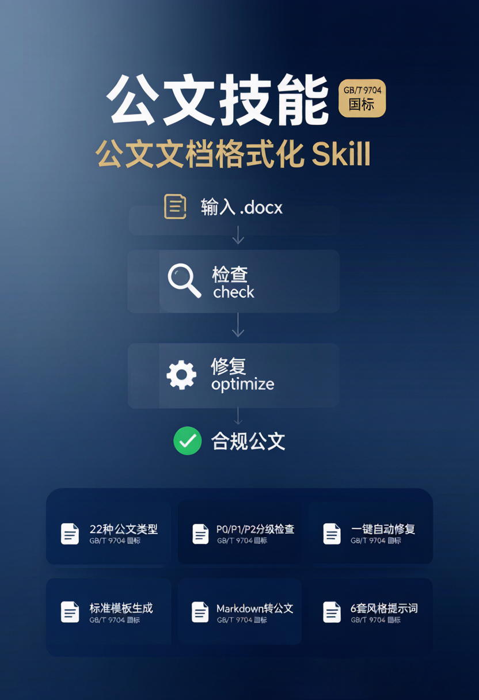

<!--
(c) 2026 Jose AI (https://www.linhut.cn)
Licensed under the MIT License. See the LICENSE file for details.
-->

# 公文文档格式化 Skill · gongwen-skill

<p align="center">
  
</p>

> 基于 **GB/T 9704《党政机关公文格式》** 国家标准的中文公文 `.docx` 处理引擎，打包为**可被 AI Agent 直接调用的 Skill**。完全自包含，克隆即用。

[](./LICENSE)


本 Skill 源自开源桌面项目 **[AI 公文智能优化助手](https://www.linhut.cn)**，将其核心格式引擎抽取、剥离桌面端/数据库依赖后独立发行，供任何人（或任何 AI Agent）直接调用，实现公文的**模板建立、解析、规则化、检查、优化、生成**全流程能力，并附带公文语言风格改写提示词。

---

## ✨ 能力一览

<p align="center">
  
</p>

| 能力 | 命令 | 说明 |
|------|------|------|
| 📋 列类型 | `list-types` | 列出 22 种支持的公文类型 |
| 🏗️ 模板建立 | `template` | 按类型生成标准空白公文模板 |
| 🔍 解析 | `parse` | `.docx` → 结构化 JSON（DocumentModel） |
| ✅ 检查 | `check` | 按 GB/T 9704 检查，分级 P0/P1/P2 |
| 🔧 优化 | `optimize` | 检查 + 自动修复 + 生成合规文档 |
| 📄 生成 | `generate` | 从 JSON 模型生成 `.docx` |
| 📝 Markdown→公文 | `md2docx` | Markdown 文本转格式化公文（支持管道输入与 Front Matter） |
| 🔴 版头 | `header` | 注入发文机关标志 + 发文字号 + 签发人 + 红色反线 |
| 📑 版记 | `footer` | 注入抄送机关 + 印发机关 + 印发日期 + 分隔线 |
| 🔢 页码 | `pagenum` | 注入 Word PAGE 域动态页码（居中 / 单右双左奇偶排版） |
| ⚙️ 规则化 | `rule-export/rule-import/rule-list` | 导出/导入/列出规则，支持三层定制 |
| ✍️ 语言风格 | `prompts/style-prompts.md` | 通用底座 + 6 套公文语言风格改写提示词 |

## 🚀 快速开始

```bash
git clone https://github.com/linhut/gongwen-skill.git
cd gongwen-skill
pip install -r requirements.txt

# 生成一份标准通知模板
python gongwen.py template notice -o 通知模板.docx

# 检查已有公文（JSON 输出）
python gongwen.py check 我的通知.docx -t notice --json

# 一键优化（检查 + 修复 + 生成）
python gongwen.py optimize 我的通知.docx -o 通知_优化后.docx -t notice

# Markdown 内容直接转为公文（支持管道输入和 Front Matter 元数据）
cat 草稿.md | python gongwen.py md2docx - -o 正式公文.docx

# 导入自定义规则（覆盖官方字体/字号等）
python gongwen.py rule-import my_company -f 公司规范.yaml

# 注入版头（发文机关标志 + 发文字号 + 签发人 + 红色反线）
python gongwen.py header 通知.docx -o 红头通知.docx --org-name 国家民委办公厅 --doc-number "民委办发〔2026〕1号"

# 注入版记（抄送 + 印发机关 + 印发日期）
python gongwen.py footer 红头通知.docx --cc 各省民委 --printer 国家民委办公厅 --print-date 2026年7月23日

# 注入页码（Word PAGE 域动态页码，单右双左奇偶排版）
python gongwen.py pagenum 红头通知.docx --alignment right

# 一步到位：检查 + 修复 + 版头/版记/页码全注入（--layout 指向 JSON 配置）
python gongwen.py optimize 我的通知.docx -o 成品.docx --layout 版式.json
```

## 📐 GB/T 9704 标准格式

| 位置 | 字体 | 字号 |
|------|------|------|
| 标题 | 方正小标宋简体 | 二号（22pt） |
| 正文 | 仿宋_GB2312 | 三号（16pt） |
| 西文/数字 | Times New Roman | — |
| 页边距 | 上 37 / 下 35 / 左 28 / 右 26（mm） | — |

> **关键实现**：中文字体需同时设置 Word XML 的 4 个字体属性（`w:ascii` / `w:hAnsi` / `w:eastAsia` / `w:cs`），否则 Word 会回退到 MS Gothic。本引擎的 `font_utils` 已处理这一细节。

## 📚 支持的 22 种公文类型

通知 · 请示 · 报告 · 函 · 会议纪要 · 纪要 · 决定 · 通告 · 公告 · 命令 · 通报 · 议案 · 批复 · 指示 · 制度 · 公报 · 意见 · 总结 · 方案/计划 · 桌签 · 技术方案 · 决议

## ⚙️ 规则化与二次定制

规则以 YAML 定义，三层优先级 **official < custom < user**：

- 官方规则：仓库内 `rules/official/*.yaml`（只读）
- 用户覆盖：`~/.gongwen-skill/user_rules/*.yaml`（同名字段覆盖官方）

无需改代码即可按本单位要求定制字体、字号、页边距等。导出某类型的合并规则以便参考：

```bash
python gongwen.py rule-export notice -o notice_rules.yaml
```

## ✍️ 公文语言风格改写

`prompts/style-prompts.md` 提供「通用底座 + 6 套」可直接喂给 LLM 的提示词规则：

0. 通用底座（所有风格共用）
1. 庄重严谨（通知/决定/意见/规定）
2. 平实简洁（函/事务通知/纪要）
3. 宏观概括（报告/总结/汇报）
4. 请示商洽（请示/呈报/商洽函）
5. 法规条文（制度/办法/章程）
6. 会议主持词/领导讲话（有高度、有重点、有条理、有力度）

配合格式引擎，实现「语言风格 + 排版格式」双合规。

## ⚠️ 使用红线

本工具为**排版格式引擎**，不涉及内容生成。请遵守以下规则：

- **不伪造、冒用或模拟真实机关正式发文** — 生成内容仅为草稿，正式发文需走完审核流程
- **不编造政策依据、统计数据、会议结论** — 缺失信息用 `XXX` 占位，不臆造
- **涉密、敏感材料应先脱敏** — 勿将涉密文件直接输入本工具
- **字体版权** — 方正小标宋简体、仿宋_GB2312、楷体_GB2312 等字体可能受版权约束，缺少字体时 Word 会回退显示，不影响排版属性正确性

## 🤖 作为 AI Skill 使用

将本仓库放入 Agent 的 skills 目录（如 Claude Code 的 `~/.claude/skills/`），Agent 读取 `SKILL.md` 后即可自动调用上述命令。`SKILL.md` 的 frontmatter 已声明触发场景。

## 🏗️ 架构

```
.docx ──parse──▶ DocumentModel(JSON) ──check/fix──▶ DocumentModel ──generate──▶ .docx
                       ▲                    ▲
                  Pydantic 中间表示     YAML 规则（三层合并）
```

所有处理都经过 `DocumentModel` 中间表示，任何模块都不直接操作 python-docx 对象。详见 [REFERENCE.md](./REFERENCE.md)。

## 📦 依赖

仅 3 个纯 Python 包：`python-docx`、`pydantic`、`pyyaml`。无数据库、无 Web 框架、无桌面端。

## 📄 许可证与出处

MIT License · **(c) 2026 Jose AI** · https://www.linhut.cn

本 Skill 源自开源项目「AI 公文智能优化助手」，格式引擎与规则 YAML 版权归原作者所有，依 MIT 许可证发行。使用、修改、分发请保留版权声明。
